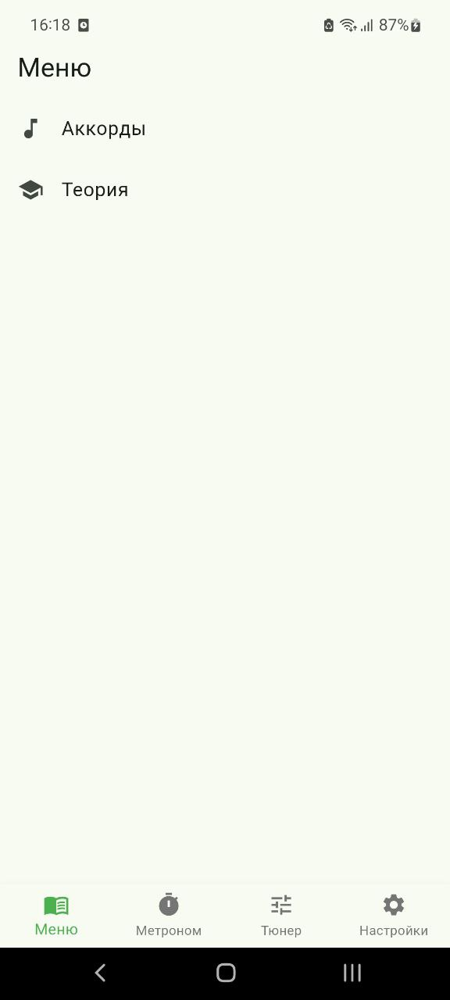

# Музыкальный помощник — Документация

Добро пожаловать в официальную документацию мобильного приложения **«Музыкальный помощник»** — вашего спутника в мире ритма и точной настройки!

## Навигация
- [Быстрый старт](/getting-started/quick-start.md)
- [Метроном](/user-guide/metronome.md)
- [Тюнер](/user-guide/tuner.md)
- [Разработчикам](/developer/architecture.md)

---

## О приложении

**«Музыкальный помощник»** — это **бесплатное**, **без рекламы** и **открытое** приложение для музыкантов любого уровня. Оно объединяет два ключевых инструмента:

1. **Метроном** — для поддержания ритма.
2. **Тюнер** — для точной настройки струнных инструментов.

Приложение разработано с использованием **Flutter** и работает на устройствах с **Android 8.0+**.

> «Точность — основа музыкального мастерства.» — _Девиз разработчиков_

### Поддерживаемые функции

| Модуль    | Возможности                         | Поддержка |
|-----------|-------------------------------------|-----------|
| Метроном  | BPM 40–240, размер такта 2/4–8/4    | +         |
| Тюнер     | Диапазон 80–1000 Гц, точность ±1 Гц | +         |
| Настройки | Переключение темы, статистика       | +         |
| Теория    | Просмотр аккордов и музтеории       | +         |

### Установка
Подробная инструкция по установке приложения на Android и iOS:

1. Скачать RuStore.
2. Разрешить доступ к микрофону (для тюнера).
3. Открыть приложение и пройти быстрый старт.

## Часто задаваемые вопросы (FAQ)
- **Можно ли использовать приложение оффлайн?**  
  Да, все основные функции доступны без интернета.

- **Можно ли сохранять настройки?**  
  Да, настройки сохраняются автоматически.

### Обратная связь
- GitHub репозиторий: [MusicHelper](https://github.com/OGonThaBlock/CourseProject7sem)

---

Узнайте больше в разделе [Быстрый старт](/getting-started/quick-start.md).
