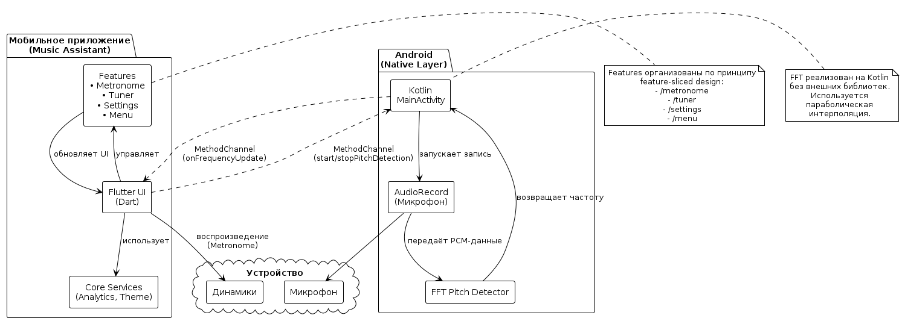

#  Разработчикам

Техническое устройство проекта.

## Навигация
- [Главная](/)
- [Быстрый старт](/getting-started/quick-start.md)
- [Метроном](/user-guide/metronome.md)
- [Тюнер](/user-guide/tuner.md)

---

## Обзор архитектуры

Приложение построено с использованием **слоистой и масштабируемой архитектуры**, что обеспечивает гибкость, расширяемость и удобство сопровождения кода.

Основные концепции:
### Ядро приложения  
   Содержит общие сервисы и компоненты, используемые во всех частях приложения:
    - Управление настройками и темой интерфейса.
    - Логирование и аналитика.
    - Абстракции для работы с аудио и внешними сервисами.

### Слои интерфейса и логики  
   UI и бизнес-логика отделены друг от друга, что позволяет:
    - Поддерживать чистый и понятный код интерфейса.
    - Тестировать бизнес-логику независимо от визуальной части.
    - Гибко менять интерфейс без влияния на внутренние процессы приложения.

### Коммуникация между компонентами  
   Все части приложения обмениваются данными через **четко определенные интерфейсы и события**, что позволяет:
    - Сохранять независимость процессов.
    - Легко обновлять отдельные функции без влияния на остальное приложение.

### Масштабируемость и сопровождение  
   Такая архитектура позволяет:
    - Добавлять новые функции без значительных изменений существующего кода.
    - Работать над проектом нескольким разработчикам параллельно, минимизируя конфликты.

##  Технологии

| Компонент         | Технология               |
|--------------------|--------------------------|
| Кроссплатформа     | Flutter 3.24             |
| Аудио (нативно)    | Kotlin + AudioRecord     |
| Pitch Detection    | FFT + параболическая интерполяция |
| Хранение данных    | shared_preferences       |

🔗 Исходный код доступен в [репозитории](https://github.com/ваш-логин/kursproj).