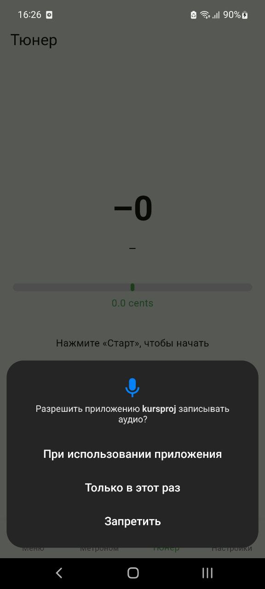

# Быстрый старт

Начните использовать «Музыкальный помощник» за 3 простых шага!

## Навигация
- [Главная](/)
- [Метроном](/user-guide/metronome.md)
- [Тюнер](/user-guide/tuner.md)
- [Разработчикам](/developer/architecture.md)

---

## Первый запуск

1. **Скачайте** приложение из магазина (RuStore) или установите APK.
2. **Запустите** приложение — появится экран с тремя вкладками: _Метроном_, _Меню_, _Тюнер_.
3. **Разрешите доступ** к микрофону при первом входе в тюнер.

> Без разрешения на микрофон **тюнер работать не будет**.

---

## Основные экраны

### Метроном
- Регулируйте **темп** (BPM 40–240).
- Настройте **размер такта** (2/4–8/4).
- Используйте **визуальные подсказки**, чтобы держать ритм.

### Тюнер
- Играйте ноту на инструменте, приложение покажет **частоту** и **точность настройки**.
- Поддерживается настройка струнных инструментов с диапазоном **80–1000 Гц**.
- Цветовая индикация: зелёный = в строю, красный = требует коррекции.

### Настройки
- Переключение **светлой/тёмной темы**.
- Просмотр **статистики использования**.
- Сброс настроек приложения.

### Теория музыки
- Просмотр **аккордов**.
- Основы **музыкальной теории** для практики.

---

## Полезные советы по использованию

- Перед использованием тюнера убедитесь, что **вокруг тихо**, чтобы микрофон правильно фиксировал ноту.
- Для метронома используйте **наушники**, если играете вместе с инструментом, чтобы не было задержки звука.
- Сохраняйте **регулярную практику**: приложение фиксирует историю использования.

---

Вернуться на [Главную](/)

---

🔗 [Официальный репозиторий на GitHub](https://github.com/OGonThaBlock/CourseProject7sem)
