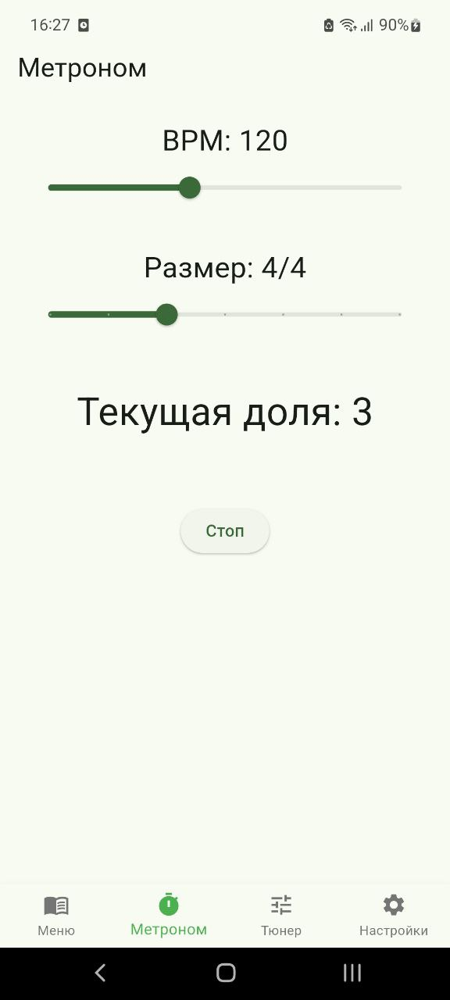

# Метроном

Настройте ритм под свои нужды.

## Навигация
- [Главная](/)
- [Быстрый старт](/getting-started/quick-start.md)
- [Тюнер](/user-guide/tuner.md)
- [Разработчикам](/developer/architecture.md)

---

## Как настроить метроном

1. Откройте вкладку **«Метроном»**.
2. Используйте **слайдер BPM**, чтобы задать темп (от **40** до **240** ударов в минуту).
3. Выберите **размер такта** (от **2/4** до **8/4**).
4. Нажмите **«Старт»** — метроном начнёт отсчёт.

>  Акцент на **первой доле** помогает чётко ощущать начало такта.

##  Параметры метронома

| Параметр     | Минимум | Максимум | По умолчанию |
|--------------|---------|----------|---------------|
| BPM          | 40      | 240      | 120           |
| Размер такта | 2/4     | 8/4      | 4/4           |

🔗 Вернуться к [Быстрому старту](/getting-started/quick-start.md)